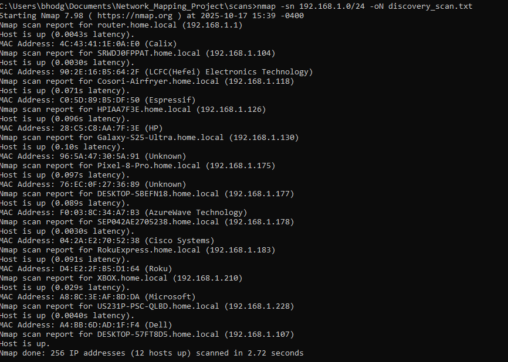
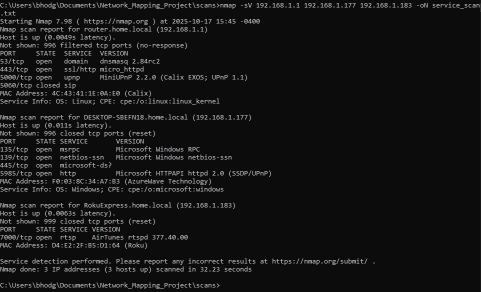

# 🌐 Network Mapping Project (Nmap)



## Overview
This project focuses on discovering and documenting all active devices within a local network using **Nmap**, a common tool used in NOC environments for network visibility and uptime assurance.  
The goal was to identify active hosts, open ports, and services to better understand the structure and exposure of a home lab environment.

---

## Goals
- Discover active devices across the LAN  
- Identify open ports and running services  
- Build a clean summary table for quick reference  
- Demonstrate awareness of internal network visibility  

---

## Tools Used
- **Nmap 7.98**  
- **PowerShell** for IP/subnet identification  
- **Windows 11** system and home network environment  

---

## Commands Used
```bash
# Ping sweep (device discovery)
nmap -sn 192.168.1.0/24 -oN scans/discovery_scan.txt

# Service and version detection (targeted)
nmap -sV -oN scans/service_scan.txt 192.168.1.1 192.168.1.177 192.168.1.183
```

---

## Network Summary

| IP Address | Hostname | Device Type | Open Ports | Services / Versions | Notes |
|-------------|-----------|--------------|-------------|----------------------|--------|
| **192.168.1.1** | router.home.local | Router / Gateway | 53, 443, 5000 | DNS, HTTPS, UPnP | Main network router |
| **192.168.1.177** | DESKTOP-SBEFN18.home.local | Windows PC | 135, 139, 445, 5985 | MSRPC, NetBIOS, SMB, WinRM | Local workstation |
| **192.168.1.183** | RokuExpress.home.local | IoT Device | 7000 | RTSP (AirPlay) | Roku streaming device |
| **192.168.1.104** | SRWDJ0FPPAT.home.local | Laptop | — | — | Active host (ping only) |
| **192.168.1.126** | HPIAA7F3E.home.local | HP Printer | — | — | Discovered via ping |
| **192.168.1.130** | Galaxy-S25-Ultra.home.local | Mobile Device | — | — | Android phone |
| **192.168.1.175** | Pixel-8-Pro.home.local | Mobile Device | — | — | Google Pixel |
| **192.168.1.210** | XBOX.home.local | Game Console | — | — | Xbox console |

---

## Findings
Eight active hosts were identified on the local network, including a router, two Windows systems, a Roku device, and multiple wireless devices.  
Detailed service scans showed standard internal protocols like SMB and WinRM on the Windows host, along with streaming ports on IoT devices.  

---

## Screenshots
| Scan Type | Description |
|------------|--------------|
|  | Initial discovery of live hosts across the subnet |
|  | Version and service detection for core devices |

---

## Learning Outcome
This project improved understanding of:
- Host discovery and port enumeration  
- Network visibility and device identification
  
---

## Author
**Billy Hodge**  
📍 Frankfort, KY  
💻 [github.com/bhodge02](https://github.com/bhodge02)  
🗓️ October 17, 2025
